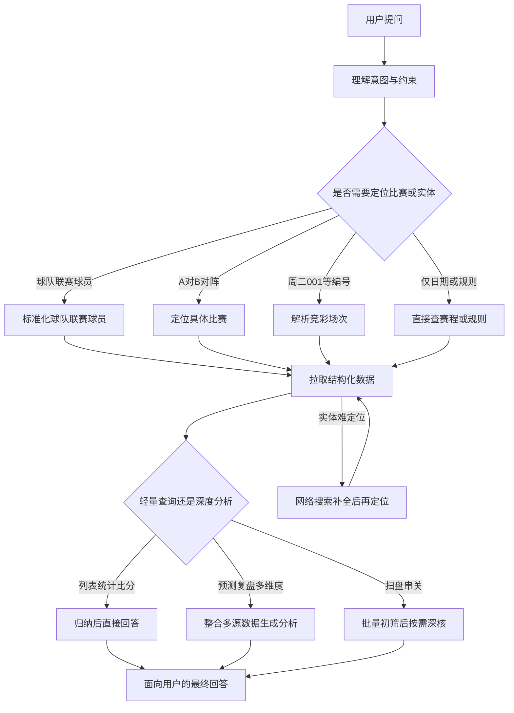

# Foretell 产品能力介绍

---

## 目录

1. [产品定位与核心价值](#一产品定位与核心价值)
2. [功能能力全景](#二功能能力全景)
3. [数据查询逻辑总览](#三数据查询逻辑总览)
4. [实体识别与场次定位](#四实体识别与场次定位)
5. [分场景查询路径](#五分场景查询路径)
6. [竞猜与赛事专业术语词典](#六竞猜与赛事专业术语词典)
7. [竞猜数据维度说明](#七竞猜数据维度说明)
8. [回答质量、安全护栏与体验规范](#八回答质量安全护栏与体验规范)

---

## 一、产品定位与核心价值

### 1.1 Foretell 是什么

Foretell 是一款**问答式体育赛事智能助手**，专注服务足球、篮球及中国体育彩票竞猜场景。用户无需学习复杂的查询语法或记住各类数据入口，只需用自然语言提问，即可获得结构化的赛程信息、统计数据、赛前预测、赛后复盘，以及竞彩购彩参考。

Foretell 的核心价值在于：将分散在多处的赛程、积分、盘口、情报、购彩规则整合为**一问即答**的对话体验。无论是「今晚五大联赛有什么可看」，还是「分析竞彩足球周二004 巴黎 VS 拜仁的胜平负和比分」，用户都可以用同一套对话界面完成。

### 1.2 解决什么问题

传统体育数据产品往往按功能模块切分——查赛程去一个入口，看赔率去另一个入口，做分析又要切换工具。Foretell 用对话式交互抹平这些割裂：

- **信息获取**：今日赛程、球队未来对阵、实时比分、完场赛果、杯赛进程，一句话即可触达。
- **深度分析**：赛前预测、赛后复盘、赛事前瞻，自动整合基本面与盘口数据，按专业模板输出。
- **购彩辅助**：竞彩/北单/十四场/任九赛程、赔率对比、走势追踪、串关方案、回报计算，覆盖彩民日常决策链路。
- **多轮延续**：支持追问比分概率、先进球预测、优化先前方案，无需重复描述上下文。

### 1.3 核心体验

| 体验维度       | 说明                                                         |
| -------------- | ------------------------------------------------------------ |
| **流式对话**   | 回答以流式方式呈现，用户无需等待全部内容生成完毕即可开始阅读 |
| **多轮追问**   | 自动保留最近对话上下文；对更早轮次的原始数据或方案，可按需回溯历史记录 |
| **多语言适配** | 默认跟随用户提问语言；支持中文、英文；检测到粤语意图时自动切换粤语表达风格 |
| **专注体育**   | 只回答体育赛事相关问题；对政治、色情、暴力等非体育内容礼貌拒绝并引导回正题 |
| **诚实边界**   | 盘口数据不足时明确标注「建议跳过此场」；不编造缺失字段；不承诺盈利 |

### 1.4 真实用户行为佐证

基于线上历史会话统计（约 9.9 万次用户提问、5.5 万条去重问题），Foretell 的高频使用模式高度集中在竞彩分析场景：

| 排名 | 典型用户问法                                                 | 场景类型             |
| ---- | ------------------------------------------------------------ | -------------------- |
| 1    | 哪一队率先进球                                               | 单场分析后的深度追问 |
| 2    | 各比分之间的概率                                             | 比分概率细化         |
| 3–14 | 分析【日期 竞彩足球 周二00X 联赛 主队 VS 客队】的胜平负、比分结果 | 竞彩单场模板分析     |
| 15   | 比分预测                                                     | 简短追问             |
| 19   | 上半场两队进球概率                                           | 时段概率追问         |
| 36   | 继续                                                         | 多轮对话延续         |

这说明 Foretell 的主战场是**竞彩单场分析 + 多轮细化追问**，而非单纯的赛程列表查询。产品设计围绕这一核心路径做了深度优化。

### 1.5 能力边界

Foretell **不做**以下事情：

- 不承诺任何投注盈利或命中率保证
- 不回答与体育赛事无关的内容
- 不在盘口数据严重缺失时强行给出单边推荐
- 不对同一玩法的同一场比赛给出互相矛盾的双向推荐（如「主不败 + 客不败」）

---

## 二、功能能力全景

Foretell 的能力按**用户任务**组织，而非按内部模块划分。下表列出六大能力域及其典型问法。

### 2.1 功能能力矩阵

| 能力模块       | 典型能力                                                     | 用户问法示例                                                 |
| -------------- | ------------------------------------------------------------ | ------------------------------------------------------------ |
| **赛程与赛果** | 今日/指定日期赛程、球队未来赛程、实时比分、完场结果、杯赛/联赛进程 | 「今晚五大联赛有什么」「利物浦接下来打谁」「世界杯赛程」「欧冠打到哪一轮了」 |
| **统计与排行** | 积分榜、射手榜、球队/球员赛季数据、历史交锋、近期近况、阵容、教练、锁定排名/争冠保级 | 「英超积分榜」「皇马对巴萨历史交锋」「雷霆本赛季数据」「谁锁定了季后赛」 |
| **预测与复盘** | 足球六段式赛前分析、篮球五段式赛前分析、赛后复盘、综合赛事前瞻 | 「分析周二004」「谁会赢」「昨天皇马那场怎么回事」「全面分析一下这场」 |
| **竞猜与购彩** | 竞彩/北单/十四场/任九赛程、赔率对比、走势追踪、串关方案、回报计算、规则查询 | 「今天竞彩怎么买」「四串一推荐」「十四场第8场」「帮我扫盘」  |
| **资讯补充**   | 伤停、转会、官宣等动态信息（结构化库缺失时）                 | 「某某球员伤了吗」「教练换了吗」                             |
| **对话延续**   | 追问上一轮赔率明细、复述先前方案、按用户指定格式重写         | 「你刚才那段再优化」「各比分概率」「按主队一段客队一段写」   |

### 2.2 运动与赛事覆盖范围

#### 足球

按赛事重要性分级展示，确保用户在「今晚有什么比赛」类宽泛提问时，优先看到高关注度赛事：

| 层级     | 覆盖赛事                                                     |
| -------- | ------------------------------------------------------------ |
| **顶级** | 英超、西甲、意甲、德甲、法甲（五大联赛）、欧冠、欧联、欧协联、亚冠、世界杯、欧洲杯、美洲杯、非洲杯、亚洲杯、中超、澳超、日职、韩K、沙特联等 |
| **次级** | 英冠、荷甲、葡超、土超、巴甲、阿甲等主流联赛                 |
| **其他** | 友谊赛、青年赛、女足等（排序靠后，不主动置顶）               |

杯赛与预选赛（世界杯、欧洲杯、世预赛、亚预赛等）按顶级赛事处理，与联赛赛程统一检索。

#### 篮球

| 层级     | 覆盖赛事                     |
| -------- | ---------------------------- |
| **顶级** | NBA、CBA、欧篮联             |
| **其他** | 全球主流篮球联赛 Top 20 预设 |

篮球分析使用独立术语体系：胜负倾向、让分、大小分，**不使用足球的「胜平负」表述**。

#### 中国体育彩票玩法

| 玩法名称            | 内部编码 | 说明                                   |
| ------------------- | -------- | -------------------------------------- |
| 竞彩足球            | 101      | 单场胜平负、让球胜平负、比分、总进球等 |
| 竞彩篮球            | 201      | 单场胜负、让分胜负、大小分等           |
| 北单胜负过关        | 301      | 北京单场胜负过关玩法                   |
| 十四场胜负彩 / 任九 | 401      | 十四场全猜或任选其中 9 场              |
| 半全场              | 402      | 预测半场与全场结果组合                 |
| 进球彩              | 403      | 预测指定场次总进球数                   |
| 北单让球胜平负      | 404      | 北京单场让球玩法                       |

### 2.3 赛程查询的三种路径

Foretell 将「查赛程」细分为三种互不替代的路径，对应不同用户意图：

| 路径             | 适用场景                   | 典型问法                                |
| ---------------- | -------------------------- | --------------------------------------- |
| **按日期查赛程** | 用户关心某一天有哪些比赛   | 「今天有什么足球比赛」「今晚 NBA 赛程」 |
| **按球队查赛程** | 用户关心某队未来或近期对阵 | 「利物浦接下来打谁」「湖人最近五场」    |
| **按彩票查赛程** | 用户关心可投注的彩票场次   | 「今天竞彩足球有哪些」「本期十四场」    |

三者不可互换：按日期查不能替代「某队接下来打谁」；按彩票查返回的是可售场次而非全部赛事。

### 2.4 预测分析的输出结构

#### 足球赛前预测（默认六段式）

1. **核心结论与推荐**：胜平负倾向、让球/亚盘倾向、大小球倾向、比分预测、1–5 星置信度
2. **赛事基础信息概览**：时间、阶段、主客、近期战绩、历史交锋
3. **赛程体能与环境因素**：休息天数、轮换压力、裁判/天气/场地影响
4. **伤停与战术权重**：关键缺阵、战术角色、攻防影响
5. **机构操盘与资金陷阱**：欧赔/亚盘/大小球、同赔、必发资金、诱盘识别
6. **战术打法与比赛走势推演**：阵型相克、上下半场节奏、走地时机

#### 篮球赛前预测（默认五段式）

1. **核心结论**：胜负倾向、让分参考、大小分参考、比分/总分区间、置信度
2. **基础信息概览**：时间、赛事、主客、近况、交锋
3. **阵容与对位**：核心持球点、内线对抗、外线火力、板凳深度、伤停
4. **节奏与盘口**：机构倾向或从攻防效率判断高低分环境
5. **比赛走势推演**：关键节次、领先建立、末节剧本

用户可指定自定义输出结构（如「主队一段、客队一段」），Foretell 会在不编造数据的前提下重排章节。

---

## 三、数据查询逻辑总览

Foretell 的「查询大脑」遵循一套稳定的路由与整合逻辑。理解这套逻辑，有助于产品、运营和分析师预判 Foretell 在不同问法下的行为。

### 3.1 查询流程总览



### 3.2 三层查询原则

Foretell 的所有查询行为建立在三条核心原则之上：

#### 原则一：先定位，再查询

几乎所有涉及具体球队、球员或比赛的问题，都先把用户的口语化表述规范为可检索对象，再发起数据查询。

典型转换示例：

| 用户原文                 | Foretell 内部处理                                |
| ------------------------ | ------------------------------------------------ |
| 「利物浦热刺这场怎么买」 | 识别两队 → 「利物浦 VS 热刺」→ 定位比赛          |
| 「分析今天欧冠皇马拜仁」 | 换算日期 → 「皇马 VS 拜仁」+ 明确日期 → 定位比赛 |
| 「马刺对雷霆 G7 分析」   | 「马刺 VS 雷霆」+ 系列赛第 7 场约束 → 定位比赛   |

这一原则的核心目的是**避免查错场次**——体育数据中同名球队、跨日比赛、系列赛多场次的情况非常常见，不先定位就直接查数据，极易张冠李戴。

#### 原则二：结构化优先，资讯兜底

| 数据类型                             | 获取方式                                       |
| ------------------------------------ | ---------------------------------------------- |
| 赛程、赛果、积分榜、球员统计、赔率   | 优先从疯狂体育数据库获取                       |
| 伤停、转会、官宣、教练变动等动态资讯 | 数据库缺失时，通过网络搜索补充                 |
| 冷门赛事实体难定位                   | 先网络搜索确认正式队名、联赛、日期，再重新定位 |

结构化数据不走网络搜索，避免把不可靠的网页信息当作比分或赔率来源。动态资讯不走数据库硬凑，避免把过时情报当作最新事实。

#### 原则三：深度与轻量分轨

Foretell 根据用户意图的复杂度，选择不同的数据整合深度：

| 路径         | 适用场景                             | 数据整合方式                           |
| ------------ | ------------------------------------ | -------------------------------------- |
| **轻量查询** | 赛程列表、积分榜、单场比分、球员数据 | 单次查询 → 归纳后直接回答              |
| **深度分析** | 预测、复盘、模板分析、带盘口解读     | 一次性并行整合多维度数据 → 按模板输出  |
| **批量初筛** | 扫盘、四串一、十四场/任九方案        | 多场比赛轻量打分 → 产出候选 → 按需深核 |

轻量路径追求速度和准确性；深度路径追求分析完整度；批量初筛在效率与深度之间取平衡，初筛结果不能直接作为最终推荐，需深度核验后方可对外输出。

### 3.3 跨域消歧规则

当多个能力域的工具功能相近时，Foretell 按以下规则消歧：

| 用户意图                   | 正确路径         | 错误路径                     |
| -------------------------- | ---------------- | ---------------------------- |
| 近期胜平负记录（事实）     | 查球队近况       | 把混合近况当作主/客场战绩    |
| 多公司赔率横向对比         | 赔率对比         | 用走势数据代替快照           |
| 赔率随时间变化             | 走势追踪         | 用快照对比代替时间线         |
| 球队大名单/阵容            | 查球队阵容       | 用某场比赛首发代替全队名单   |
| 某场比赛首发阵容           | 查比赛阵容       | 用球队大名单代替当场首发     |
| 两队历史交锋（无指定比赛） | 按两队 ID 查交锋 | 先找比赛再查交锋（多此一举） |
| 推荐（无购彩语境）         | 推荐观看         | 默认生成投注方案             |

---

## 四、实体识别与场次定位

实体识别与场次定位是 Foretell 查询链路的**第一道工序**。定位准确，后续所有数据才有意义；定位错误，分析再精彩也是空中楼阁。

### 4.1 四种提问入口

Foretell 根据用户输入的形态，自动选择对应的定位策略：

#### 入口一：对阵双方（最高频）

**典型输入：**

- 「马赛 VS 欧塞尔」
- 「湖人勇士今晚」
- 「马刺对雷霆 G7」
- 「利物浦热刺这场怎么买」（无分隔符，需自动识别两队）

**处理逻辑：**

1. 从用户原文中识别两支球队，改写为标准「A VS B」格式
2. 剥离非球队名部分（「这场怎么买」「赔率对比」「复盘」等）
3. 若用户提到日期或相对日期（今天/今晚/明天/后天），换算为明确日期并传入
4. 发起比赛定位，获取唯一比赛标识
5. 后续所有单场查询透传该比赛的运动类型（足球/篮球）

**特殊约束——系列赛场次：**

当用户明确提到 G7、抢七、第七场、系列赛第 N 场时：

- 该约束必须保留，不能用最近一次已结束的交手替代
- 若未找到指定系列赛场次，如实告知，**禁止**降级分析其他场次
- 禁止用 G6 的结果反驳用户指定的 G7 分析请求

#### 入口二：竞彩编号

**典型输入：**

- 「周二001」
- 「竞彩篮球周一305」
- 「本期任选14场第8场」
- 「分析【2026-04-29 竞彩足球周二004 欧冠 巴黎圣曼 VS 拜仁】」

**处理逻辑：**

1. 识别彩票玩法类型（竞彩足球 / 竞彩篮球 / 十四场 / 任九 / 北单等）
2. 解析场次编号或期号
3. 映射到具体比赛及联赛、主客队信息
4. 进入后续数据查询或分析流程

竞彩编号是彩民最高频的入口方式。Foretell 完整支持「日期 + 玩法 + 编号 + 联赛 + 对阵」的复合模板，这也是线上 Top 问题的标准格式。

#### 入口三：球队 / 联赛 / 球员名

**典型输入：**

- 「英超积分榜」
- 「雷霆本赛季数据」
- 「皇马主教练是谁」
- 「孙兴慜本赛季进球」

**处理逻辑：**

1. 识别实体类型（球队 / 联赛 / 球员）
2. 标准化为数据库中的正式名称与 ID
3. 根据问题类型选择对应查询（积分榜、赛季统计、教练信息、球员排名等）

**热门联赛快捷路径：** 当用户问「今晚五大联赛有什么」「今天 NBA 赛程」时，无需逐个识别联赛，直接使用预设筛选（五大联赛 / NBA / CBA / 中超）。

#### 入口四：纯日期 / 期号

**典型输入：**

- 「今天有什么比赛」
- 「本期十四场」
- 「明天竞彩篮球」

**处理逻辑：**

| 玩法                                   | 日期/期号规则                                                |
| -------------------------------------- | ------------------------------------------------------------ |
| 竞彩足球 / 竞彩篮球                    | 用户提到今天/明天/后天/具体日期时，必须传入日期              |
| 北单 / 十四场 / 任九 / 半全场 / 进球彩 | 用户未指定期号时，自动读取当前在售期号；用户明确给出期号则直接使用 |
| 普通赛程                               | 按日期查询，可按联赛预设或联赛名筛选                         |

### 4.2 定位失败兜底机制

当对阵模糊、冷门赛事、或数据库中暂无匹配时，Foretell 启动兜底流程：

1. **网络搜索**：用建议的搜索词或自行构造「球队A VS 球队B 比赛 赛程 日期」进行搜索
2. **信息提取**：从搜索结果中提取球队正式全名、所属联赛、比赛日期
3. **重新定位**：用提取到的信息再次发起比赛定位
4. **结果处理**：
   - 定位成功 → 正常进入后续流程
   - 仍失败 → 如实告知未找到匹配比赛，附上网络搜索中获取的参考信息

兜底流程最多重试一次，避免无限循环。这一机制确保用户在查询澳超、韩K、沙特联等相对冷门赛事时，仍有较高的定位成功率。

### 4.3 实体识别的常见误区与纠正

| 误区                         | Foretell 的处理                                        |
| ---------------------------- | ------------------------------------------------------ |
| 用户未给日期，默认最近一场   | 优先匹配最近未开始或进行中的比赛；有日期线索时必须使用 |
| 把「利物浦热刺」当作一个队名 | 自动拆分为「利物浦 VS 热刺」                           |
| G7 被当作普通对阵            | 保留系列赛约束，不降级                                 |
| 竞彩编号跨日失效             | 结合日期 + 编号双重定位                                |
| 英文队名 vs 中文译名         | 支持模糊匹配；英文提问时优先使用英文名                 |

---

## 五、分场景查询路径

本章按真实高频场景，逐一说明「用户怎么问 → Foretell 怎么想 → 查哪些数据 → 怎么组织回答」。这是理解 Foretell 数据查询经验的**核心章节**。

### 场景 A：纯数据查询

**典型问法：**

- 「今晚 NBA 有什么」
- 「切尔西本赛季进了多少球」
- 「英超射手榜」
- 「利物浦接下来打谁」

**Foretell 怎么想：**

这是事实性查询，用户要的是精确数据或清单，不需要预测或盘口解读。关键是**意图对齐**——用户到底要列表、要一个数字、还是要排名。

**查询路径：**

| 问法类型     | 路径                                                 |
| ------------ | ---------------------------------------------------- |
| 某日热门赛程 | 按日期 + 联赛预设（五大联赛/NBA/CBA/中超）直接查赛程 |
| 某日特定联赛 | 识别联赛 → 按日期 + 联赛查赛程                       |
| 球队未来赛程 | 识别球队 → 查球队赛程（跨赛事）                      |
| 积分榜/排名  | 识别联赛 → 查联赛积分                                |
| 球队赛季统计 | 识别球队 → 查球队赛季数据                            |
| 球员排名     | 识别联赛 → 查球员榜单                                |

**回答原则：**

- **归纳优先于罗列**：用户问「谁锁定了季后赛」，只报告真正锁定精确名次的球队，而非把所有「锁定不低于某名次」的球队都列出
- **语义精确匹配**：「锁定排名」≠「锁定不低于某排名」；「最近怎么了」≠「最近5场比分」
- **诚实面对不足**：数据不能精确回答时，说明局限性，给出能确定的部分

### 场景 B：单场预测 / 模板分析（最高频）

**典型问法：**

- 「分析【竞彩足球周二004 巴黎 VS 拜仁】胜平负、比分」
- 「谁会赢」
- 「这场全面分析一下」
- 「按四步稳球模板分析」

**Foretell 怎么想：**

这是 Foretell 的核心场景，占线上提问的绝对多数。用户要的不是单一数据点，而是**多维度整合后的专业判断**。必须走深度分析路径，一次性拉齐所有可用维度。

**查询路径：**

```
定位比赛 → 并行整合以下维度 → 按模板生成分析
```

**整合的数据维度：**

| 类别             | 具体内容                                           |
| ---------------- | -------------------------------------------------- |
| 基础信息         | 比赛时间（北京时间）、联赛、阶段、主客、场地、天气 |
| 积分排名         | 双方联赛排名、进失球、主客场拆分                   |
| 近期近况         | 近 N 场胜平负（区分整体/主场/客场）                |
| 历史交锋         | 近 3–5 场对阵记录                                  |
| 阵容伤停         | 预计首发、缺阵、停赛                               |
| 球员能力         | 关键球员数据                                       |
| 欧赔             | 多家公司胜平负赔率                                 |
| 亚盘             | 让球线、水位、中文方向解读                         |
| 大小球           | 盘口线与水位                                       |
| 深度数据（足球） | 情报标签、赛事分析、同赔历史、必发资金、赔率历史   |

**输出结构（足球默认六段）：**

1. 核心结论与推荐（4 行以内，高密度）
2. 赛事基础信息概览
3. 赛程体能与环境因素
4. 伤停与战术权重
5. 机构操盘与资金陷阱
6. 战术打法与比赛走势推演

**数据诚实规则：**

| 情况                   | 处理方式                                                     |
| ---------------------- | ------------------------------------------------------------ |
| 欧赔 + 亚盘均缺失      | 整段标注「盘口数据不足，建议跳过此场」，不逐格填「数据不足」伪装完成 |
| 淘汰赛问联赛排名       | 说明「不适用」，补充最接近的替代信息（如淘汰赛阶段、过往小组赛表现） |
| 某维度存在但无数据     | 写「数据不足」                                               |
| 某维度本身不成立       | 写「不适用」并说明原因                                       |
| 盘口线与水位方向不一致 | 优先输出高风险或观望结论，不强行单边判断                     |
| 初盘与即时盘已换线     | 说明「已换线/已重定价」，不混用不同盘口线比较                |

**多轮追问（本场景的自然延伸）：**

用户在收到六段分析后，高频追问：

- 「比分预测」
- 「哪一队率先进球」
- 「各比分之间的概率」
- 「上半场两队进球概率」

这些追问依托已定位的比赛上下文，在既有数据基础上做细化推演，无需重新定位。

### 场景 C：赛后复盘

**典型问法：**

- 「昨天皇马那场怎么回事」
- 「复盘一下湖人勇士」
- 「上周日英超焦点战回顾」

**Foretell 怎么想：**

用户关心的是已结束比赛的过程解读，不是赛前预测。需定位到**已完场**的比赛，整合赛果与关键事件。

**查询路径：**

```
定位已结束比赛 → 整合赛果、技术统计、关键事件 → 按复盘模板输出
```

足球与篮球使用不同的复盘模板。复盘不涉及购彩推荐，无需附加投注风险提示（除非用户主动追问投注相关问题）。

### 场景 D：单场购彩推荐

**典型问法：**

- 「这场怎么买」
- 「主不败可以吗」
- 「给个单场方案」
- 「赛事方案」

**Foretell 怎么想：**

用户带有明确的投注倾向。这不仅是分析，更是决策辅助。必须走深度分析路径，且最终输出必须满足**推荐一致性**和**安全护栏**。

**查询路径：**

```
定位比赛 → 深度分析 → 形成单一明确主推方向 → 生成投注方案 → 附加风险提示
```

**推荐一致性规则：**

- 同一场比赛的同一玩法（胜平负、让球、大小球等），**只能给出一个明确主推方向**
- 严禁「主不败 + 客不败」类互相矛盾的双向推荐
- 冷门或抢分可能只能在风险提示中用中性语气描述，不能用「推荐」「建议买入」等投注语气

**强制结尾：**

所有购彩相关回复结尾必须附加：**「⚠️ 彩票有风险，投注需谨慎」**

### 场景 E：串关 / 扫盘 / 十四场 / 任九

**典型问法：**

- 「今天竞彩四串一怎么配」
- 「帮我扫盘」
- 「十四场给个方案」
- 「本期任九推荐」

**Foretell 怎么想：**

这是批量决策场景，用户需要对多场比赛同时做出判断。若在每场比赛上都走完整深度分析，响应时间过长；若只做轻量筛选，深度又不够。Foretell 采用**「批量初筛 → 按需深核」**的两阶段策略。

**查询路径：**

```
第一阶段：拉取当日/当期彩票赛程
    ↓
第二阶段：批量轻量初筛（近况 + 盘口快速打分，产出候选场次）
    ↓
第三阶段（按需）：用户要求详细分析时，对入选场次逐一深度核验
    ↓
第四阶段：生成串关/方案 → 附加风险提示
```

**初筛 vs 深核的关系：**

| 阶段     | 产出                       | 能否作为最终推荐           |
| -------- | -------------------------- | -------------------------- |
| 批量初筛 | 候选场次、初筛方向、置信度 | **不能**直接作为最终推荐词 |
| 深度核验 | 完整六段分析、明确主推方向 | **可以**作为最终推荐       |

当初筛方向与深度核验不一致时：

- **以深度核验为准**
- 在回复中显式说明：「初筛方向为 X，深度核验后修正为 Y，依据：……」
- 禁止把两套相反结论同时呈现给用户

**扫盘效率原则：**

用户只说「扫盘」「四串一」而未要求逐场展开时，优先走批量初筛路径，不对每一场都调用完整深度分析。只有用户明确说「详细分析第 X 场」「展开讲某场」时，才补做深度核验。

### 场景 F：赔率专项查询

**典型问法：**

- 「这场赔率对比一下」
- 「赔率有变化吗」
- 「今天哪些比赛赔率变动最大」
- 「凯利指数怎么看」

**Foretell 怎么想：**

用户关注的是盘口本身，而非完整比赛分析。需区分赔率查询的四个维度。

**查询路径：**

| 用户意图                 | 查询方式                          | 说明                                     |
| ------------------------ | --------------------------------- | ---------------------------------------- |
| 多家公司当前赔率横向对比 | 赔率对比                          | 同一时刻、同一场比赛的欧赔快照           |
| 赔率随时间的变化         | 走势追踪                          | 从初盘到临场的纵向变动，辅助判断买入时机 |
| 按变动幅度排名           | 先获取当日彩票场次 → 再按变动排序 | 需要先知道「今天有哪些比赛」             |
| 凯利指数交叉验证         | 独立凯利查询                      | 用户显式追问时使用                       |
| 完整赔率时间线           | 独立时间线查询                    | 用户显式追问时使用                       |

**注意：** 常规预测/复盘中，凯利和赔率历史已内嵌在深度分析里，无需单独查询。独立赔率工具用于用户显式追问、或深度分析后某维度仍缺失的场景。

### 场景 G：多轮追问与对话延续

**典型问法：**

- 「你刚才那段方案再优化一下」
- 「各比分概率」
- 「把刚才的预测原样再发一遍」
- 「继续」

**Foretell 怎么想：**

用户引用的内容可能就在上一轮（自动上下文内），也可能在更早的轮次（已超出自动上下文窗口）。Foretell 区分两种情况处理。

**处理机制：**

| 情况                             | 处理方式                                 |
| -------------------------------- | ---------------------------------------- |
| 最近几轮对话                     | 自动保留最近 6 轮用户/助手发言，直接延续 |
| 追问更早的原始数据（如某行赔率） | 回溯历史工具结果，不凭印象编造           |
| 追问更早的助手回复原文           | 回溯历史消息记录，按原文续写或优化       |
| 用户指定格式重写                 | 优先满足用户结构要求，不丢失关键信息     |

**常见追问链示例：**

```
用户：分析【竞彩足球周二004 巴黎 VS 拜仁】胜平负、比分
Foretell：[六段完整分析]
用户：比分预测
Foretell：[具体比分区间与概率]
用户：哪一队率先进球
Foretell：[先进球概率分析]
用户：上半场进球概率
Foretell：[时段细化]
```

这一追问链在真实用户行为中极为高频，Foretell 的设计确保上下文中的比赛定位在追问过程中保持稳定，无需用户重复提供场次信息。

### 场景 H：赛事前瞻 / 争冠保级

**典型问法：**

- 「英超争冠还有悬念吗」
- 「谁已经降级了」
- 「哪些球队锁定了季后赛」
- 「皇马已经锁定冠军了吗」

**Foretell 怎么想：**

这是联赛宏观层面的判断性问题，需要对积分榜、剩余赛程和数学阈值进行综合推理。

**查询路径：**

```
识别联赛 → 获取积分榜 + 后续赛程 + 锁定/保级阈值计算 → 按争冠保级叙事模板输出
```

**语义精度要求：**

- 「锁定排名」= 精确名次已确定，再无变化可能
- 「锁定不低于某排名」= 名次下限已确定，但具体名次仍可能有变化
- 只报告前者为「已锁定」，后者应表述为「至少锁定第 X 名」

---

## 六、竞猜与赛事专业术语词典

本章面向赛事分析师与竞彩从业者，系统梳理 Foretell 在分析与对话中涉及的专业术语。理解这些术语，有助于准确提问、正确解读 Foretell 的回答。

### 6.1 彩票玩法术语

| 术语               | 含义                                                       | Foretell 中的用法                             |
| ------------------ | ---------------------------------------------------------- | --------------------------------------------- |
| **竞彩足球**       | 中国体育彩票竞猜足球游戏，可猜胜平负、让球、比分、总进球等 | 按日期查在售场次；单场分析的核心玩法          |
| **竞彩篮球**       | 中国体育彩票竞猜篮球游戏，可猜胜负、让分、大小分           | 使用篮球术语，不出现「胜平负」                |
| **北单胜负过关**   | 北京单场足球彩票，猜胜负结果                               | 按期号查在售场次                              |
| **北单让球胜平负** | 北京单场让球玩法                                           | 与竞彩让球规则有差异，Foretell 按各自规则处理 |
| **十四场胜负彩**   | 猜指定 14 场比赛的胜平负结果                               | 按期号查 14 场列表                            |
| **任九 / 任选九**  | 从十四场中任选 9 场猜胜平负                                | 与十四场共用期号，场次范围是 14 场的子集      |
| **半全场**         | 同时猜半场和全场的胜平负组合                               | 独立玩法，按期号查询                          |
| **进球彩**         | 猜指定场次的总进球数                                       | 独立玩法，按期号查询                          |

**场次编号规则：**

- 「周二001」= 当周竞彩足球开售日（周二）的第 1 场比赛
- 「竞彩篮球周一305」= 当周竞彩篮球周一开售的第 305 场（编号可超过当日场次总量，因编号全局递增）
- 「本期任选14场第8场」= 当前在售十四场期号中的第 8 场比赛

**串关术语：**

| 术语                         | 含义                                         |
| ---------------------------- | -------------------------------------------- |
| **串关**                     | 将多场比赛的投注组合在一起，全部命中才中奖   |
| **二串一 / 三串一 / 四串一** | 分别选 2/3/4 场比赛串关                      |
| **稳胆**                     | 把握较大的场次，作为串关的「基石」           |
| **冷门**                     | 赔率较高、赛果不确定性大的场次               |
| **扫盘**                     | 批量筛选当日所有彩票场次，找出值得关注的比赛 |

### 6.2 盘口与市场术语

| 术语            | 英文/缩写                | 含义                                             | Foretell 中的用法                |
| --------------- | ------------------------ | ------------------------------------------------ | -------------------------------- |
| **胜平负**      | 1X2 / WDL                | 猜主队胜、平局、客队胜。仅用于足球               | 篮球场景禁止使用此术语           |
| **让球 / 亚盘** | Asian Handicap           | 强队让弱队一定球数，平衡双方胜率                 | 方向以数据库中文表述为准         |
| **大小球**      | Over/Under (O/U)         | 猜全场总进球数高于或低于盘口线。用于足球         |                                  |
| **大小分**      | Totals                   | 猜全场总得分高于或低于盘口线。用于篮球           |                                  |
| **让分**        | Spread                   | 篮球版的让球，强队让弱队一定分数                 | 篮球专用术语                     |
| **欧赔**        | European Odds            | 欧洲赔率格式，直接反映胜平负（或胜负）的赔付比例 | 多家公司横向对比                 |
| **初盘**        | Opening Line             | 博彩公司首次开出的盘口                           | 走势分析的起点                   |
| **即时盘**      | Live Line                | 当前最新的盘口                                   | 与初盘对比判断变动方向           |
| **临场盘**      | Closing Line             | 开赛前最后的盘口                                 | 通常被认为最接近真实概率         |
| **走地**        | In-Play                  | 比赛进行中的滚球投注                             | 分析中可能提示走地时机           |
| **实力盘**      | —                        | 盘口反映双方真实实力差距                         | 分析中判断盘口性质               |
| **诱导盘**      | —                        | 盘口故意引导投注方向，与实际概率偏离             | 分析中重点识别并提示             |
| **凯利指数**    | Kelly Index              | 衡量赔率是否「超值」的指标，偏离 1 越远价值越大  | 深度分析内嵌；用户追问时独立查询 |
| **必发**        | Betfair                  | 全球最大博彩交易所，反映真实资金方向             | 分析资金陷阱时参考               |
| **同赔**        | Same Odds / Compensation | 历史上相同赔率下的赛果分布统计                   | 辅助判断当前赔率的合理性         |
| **水位**        | —                        | 赔率的具体数值，用于判断赔付高低                 | 亚盘分析的核心要素               |

**让球方向约定（重要）：**

Foretell 以**主队视角**解读让球盘口：

| 盘口线   | 含义     |
| -------- | -------- |
| line < 0 | 主队让球 |
| line > 0 | 主队受让 |
| line = 0 | 平手     |

Foretell 在输出让球方向时，**必须直接复述数据库给出的中文表述**（如「主队让半球」），禁止根据数字自行推断或组合「+0.25 / -0.5」等表达。这是避免用户纠错的最关键产品规则之一。

### 6.3 赛事分析术语

| 术语                | 含义                                                 | 使用注意                                           |
| ------------------- | ---------------------------------------------------- | -------------------------------------------------- |
| **近况**            | 球队最近 N 场比赛的胜平负记录                        | 区分「整体近况」「主场近况」「客场近况」，不可混用 |
| **交锋 / 对战记录** | 两支球队历史对阵结果                                 | 重点关注近 3–5 场                                  |
| **伤停**            | 球员因伤或停赛无法出场                               | 需说明缺阵者的战术角色和影响                       |
| **轮换**            | 教练主动更换首发阵容                                 | 影响战力和体能判断                                 |
| **体能**            | 球队近期比赛密度和休息天数                           | 连续硬仗或密集赛程是重要变量                       |
| **中立场**          | 比赛不在任何一方主场进行                             | 无主客场优势，相关数据需特殊处理                   |
| **战意**            | 球队对本场比赛的重视程度                             | 结合排名、赛程、赛事阶段判断                       |
| **阵型**            | 球队战术布置（如 4-3-3、3-5-2）                      | 足球分析专用                                       |
| **进球时间分布**    | 球队在不同时间段（0-15分、16-30分等）的进球/失球统计 | 用于推演上下半场节奏                               |
| **对位**            | 篮球中球员之间的直接攻防匹配                         | 篮球分析专用                                       |
| **回合节奏**        | 篮球比赛的速度（回合数多少）                         | 影响大小分判断                                     |
| **攻防效率**        | 球队每百回合的得分/失分                              | 篮球核心分析指标                                   |

**足球 vs 篮球术语对照：**

| 概念      | 足球用语    | 篮球用语       |
| --------- | ----------- | -------------- |
| 猜输赢    | 胜平负      | 胜负（无平局） |
| 让分/让球 | 让球 / 亚盘 | 让分           |
| 猜总分    | 大小球      | 大小分         |
| 战术布置  | 阵型        | 对位 / 阵容    |

---

## 七、竞猜数据维度说明

Foretell 的深度分析依赖多维度数据的并行整合。本章说明每个维度的**内容**、**分析价值**，以及**使用边界**。

### 7.1 数据维度总表

| 数据维度          | 具体内容                                                   | 在分析中的作用             | 缺失时的处理              |
| ----------------- | ---------------------------------------------------------- | -------------------------- | ------------------------- |
| **基础信息**      | 比赛时间（北京时间）、联赛、阶段、主客场、场地、天气、裁判 | 建立比赛语境，判断环境因素 | 跳过对应细项              |
| **积分与排名**    | 联赛积分榜、双方排名、进失球、主客场拆分                   | 实力基准、战意判断         | 淘汰赛说明「不适用」      |
| **近况**          | 近 N 场胜平负、进球失球、主/客场拆分                       | 状态趋势判断               | 样本不足时如实说明        |
| **历史交锋**      | 近 3–5 场对阵记录、进球分布                                | 风格克制、心理优势         | 样本过少时降低权重        |
| **阵容伤停**      | 预计首发、确认缺阵、停赛球员                               | 战术权重调整               | 无数据时跳过对应细项      |
| **球员能力**      | 关键球员赛季数据、能力评估                                 | 对位分析、球星影响力       | 无数据时跳过              |
| **欧赔**          | 多家博彩公司胜平负赔率                                     | 市场概率锚点               | 与亚盘均缺 → 建议跳过此场 |
| **亚盘**          | 让球线、水位、中文方向解读                                 | 强弱判断、穿盘风险         | 与欧赔均缺 → 建议跳过此场 |
| **大小球/大小分** | 盘口线、大/小水位                                          | 进球/得分环境判断          | 无盘口时从攻防效率推断    |
| **赔率走势**      | 初盘 → 即时盘 → 临场盘变动                                 | 诱盘识别、买入时机         | 无历史时仅分析当前盘口    |
| **同赔历史**      | 相同赔率下的历史赛果分布                                   | 统计回归参考               | 无数据时跳过              |
| **必发/凯利**     | 交易所资金方向、凯利偏离值                                 | 资金陷阱识别               | 无数据时跳过              |
| **情报标签**      | 伤停、内部消息、媒体摘要                                   | 辅助验证，不可覆盖硬统计   | 仅作参考，不作主要论据    |

### 7.2 各维度详解

#### 基础信息

每场比赛的「身份证」。Foretell 在展示时间时优先使用北京时间（`match_time_beijing`），避免用户自行换算时区。赛事阶段（联赛第几轮、淘汰赛首回合/次回合、小组赛等）直接影响分析框架——淘汰赛不应套用联赛排名的分析逻辑。

#### 积分与排名

提供双方的「实力坐标」。不仅看总排名，还看主客场拆分——有些球队主场强势客场疲软，总排名会掩盖这一特征。Foretell 在分析中会区分引用，避免把总排名当作主客场战绩。

#### 近况

反映球队「当前状态」，是预测中权重最高的基本面维度之一。关键注意点：

- **整体近况**（主客混合）≠ **主场近况** ≠ **客场近况**
- 用户问「主队近5场主场」时，必须读主场专属数据，不能把混合数据当作主场战绩
- 样本不足（如赛季刚开始只打了 2 场）时，如实告知而非强行分析

#### 历史交锋

提供双方的「交手记忆」。Foretell 重点关注近 3–5 场，不把十年前的交锋原样复述。交锋数据用于判断风格克制（如一方是否「天克」另一方），但不作为唯一预测依据。

#### 阵容伤停

决定「谁能上场」。缺阵球员的价值不仅看名气，更看其战术角色——一个主力中卫缺阵对防守体系的影响，远大于一个替补边锋缺阵。Foretell 在分析中会说明缺阵的具体影响，而非仅列出名字。

#### 欧赔、亚盘、大小球

构成盘口分析的三驾马车：

- **欧赔**回答「市场认为谁更可能赢」
- **亚盘**回答「强队要让多少才能平衡」
- **大小球**回答「市场认为这场比赛进几个球」

三者应交叉验证。若欧赔看好主队但亚盘浅开，可能存在诱导风险。Foretell 在第五部分「机构操盘与资金陷阱」中专门处理这类矛盾。

#### 赔率走势

从初盘到临场的变动轨迹，揭示市场态度的变化：

- 赔率下降 = 市场看好该方向的资金增加
- 赔率上升 = 市场信心下降或刻意诱导
- 临场急剧变动 = 可能有突发消息（伤停、天气等）

Foretell 在判断走势时，若盘口线本身已发生变化（换线/重定价），不会把初盘与即时盘的水位直接比较，避免得出错误结论。

#### 同赔历史

统计历史上出现相同赔率时的赛果分布。例如「主胜 1.85 的历史命中率约为 55%」，为当前判断提供统计回归参考。样本量不足时权重降低。

#### 必发 / 凯利

反映「聪明钱」的方向：

- **必发**显示交易所真实资金流向，大额买入某方向通常意味着专业玩家看好
- **凯利指数**衡量当前赔率是否偏离「公平赔率」，偏离越大越可能存在投注价值

Foretell 用这些数据辅助识别资金陷阱，但不单独作为推荐依据。

#### 情报标签

来自媒体和专业情报源的文本摘要，涵盖伤停确认、内部消息、教练表态等。情报的优先级**低于**结构化硬数据——情报说「主力受伤」但阵容数据显示其首发，以阵容数据为准。

### 7.3 数据覆盖与诚实原则

Foretell 在深度分析时会标注每个维度的可用状态。这一机制确保 Foretell 不会在数据缺失时「硬写」分析：

| 标注     | 含义                         | 输出处理                               |
| -------- | ---------------------------- | -------------------------------------- |
| 数据充分 | 该维度数据完整可用           | 正常分析                               |
| 数据不足 | 该维度存在但工具未返回       | 标注「数据不足」，不编造               |
| 不适用   | 该维度在当前赛事语境下不成立 | 说明原因，补充替代信息                 |
| 建议跳过 | 关键维度（欧赔+亚盘）均缺失  | 整场标注「盘口数据不足，建议跳过此场」 |

---

## 八、回答质量、安全护栏与体验规范

### 8.1 回答生成原则

Foretell 在拿到数据后，不会直接转述工具输出，而是经过以下思维步骤再生成最终回答：

#### 原则一：重新审视用户意图

用户到底问了什么？是要一个精确答案、一份清单、一个判断，还是一份分析？在组织回答前，先在心里重述用户的核心问题，确保回答方向正确。

#### 原则二：意图对齐过滤

工具返回的数据中，哪些直接回答了用户的问题？哪些是背景信息？哪些是噪音？只呈现与用户意图直接相关的内容。

示例：用户问「谁锁定了排名」，工具可能返回 30 支球队的分析，但只有 2–3 支真正锁定了精确名次——只报告前者。

#### 原则三：归纳优先于罗列

判断性/归纳性问题（「谁更强」「值得看吗」「怎么了」），先给结论，再用关键数据佐证。工具返回 20 行数据不代表要呈现 20 行。

#### 原则四：精确匹配用户语义

| 用户说的   | 不能偷换为       |
| ---------- | ---------------- |
| 锁定排名   | 锁定不低于某排名 |
| 推荐比赛   | 列出所有比赛     |
| 最近怎么了 | 最近5场比分      |
| 谁会赢     | 双方数据对比     |

#### 原则五：诚实面对信息不足

工具结果不能精确回答用户问题时，坦诚说明局限性，给出能确定的部分，不用似是而非的数据或换一个相近问题来回答。

### 8.2 购彩安全护栏

Foretell 对涉及购彩的回复实施强制性安全护栏：

#### 风险提示（强制）

所有涉及购彩推荐的回复，结尾必须附加：

> **⚠️ 彩票有风险，投注需谨慎**

不提供任何保证盈利的承诺，所有推荐仅供参考。

#### 极端投注识别与劝诫

当识别到以下信号时，Foretell 会加重安全提示并主动劝诫：

| 信号                                  | Foretell 的响应                                      |
| ------------------------------------- | ---------------------------------------------------- |
| 「全部押」「押全部身家」「all in」    | 劝阻，建议合理分配资金                               |
| 「回本」「翻本」「亏了想赢回来」      | 识别追损行为，说明追损是高风险行为，建议冷静后再决策 |
| 极端比分投注（如 7:1、8:0）且金额较大 | 用概率数据说明极端比分的极低命中率                   |
| 短时间内反复要求推荐                  | 提醒理性投注，避免冲动                               |

劝诫原则：**不说教，用数据说话**。例如：「7:1 的历史出现概率约为 0.3%，即使赔率高回报大，命中概率也非常低。」

#### 推荐一致性

- 同一场、同一玩法，只给一个明确主推方向
- 矛盾推荐（主不败 + 客不败）绝对禁止
- 冷门可能只能在风险提示中中性描述

### 8.3 输出纪律

| 规则               | 说明                                                         |
| ------------------ | ------------------------------------------------------------ |
| **不输出中间态**   | 严禁生成「正在为您查询」「让我先查一下」等过渡语，只输出完整最终答案 |
| **不暴露内部结构** | 不暴露工具名、字段名、内部数据结构；数据来源统一称「疯狂体育数据库」 |
| **聚焦当前问题**   | 不汇总历史对话中的旧任务，只回答当前最末尾的问题             |
| **尊重用户格式**   | 用户指定输出结构时优先满足（如「主队一段、客队一段」「只要结论不要盘口」） |
| **推荐语义消歧**   | 「推荐」无购彩语境时，理解为推荐观看而非投注                 |
| **Markdown 规范**  | 表格前保留空行；块级内容之间用空行分隔，确保各端渲染一致     |
| **语言一致**       | 全文保持单一语种，与用户提问语言及文字体系一致               |

### 8.4 内容安全

- 拒绝回答政治敏感、色情、暴力等与体育赛事无关的内容
- 遇到超出服务范围的问题，礼貌拒绝并引导回体育话题
- 标准话术：「我是体育赛事助手，这个问题超出了我的专业范围。有什么赛事问题我可以帮你吗？」

---

## 附录：典型用户旅程示例

以下是一条完整的真实用户旅程，展示 Foretell 如何在一次会话中串联多种能力：

```
[第 1 轮]
用户：分析【2026-04-29 03:00:00 竞彩足球周二004 欧冠 巴黎圣曼 VS 拜仁】
      的赛事的胜平负、比分结果，并描写100-300字的分析内容
Foretell：
  → 定位比赛（竞彩编号 + 对阵双重确认）
  → 深度整合（基本面 + 盘口 + 情报）
  → 输出六段分析，含胜平负倾向、让球倾向、大小球倾向、比分预测

[第 2 轮]
用户：比分预测
Foretell：
  → 沿用已定位比赛上下文
  → 细化比分区间与概率分布

[第 3 轮]
用户：哪一队率先进球
Foretell：
  → 沿用上下文
  → 分析双方开场进攻倾向、进球时间分布
  → 给出先进球概率判断

[第 4 轮]
用户：上半场两队进球概率
Foretell：
  → 沿用上下文
  → 基于进球时间分布数据
  → 给出上半场双方进球概率

[第 5 轮]
用户：这场怎么买
Foretell：
  → 沿用上下文，无需重新定位
  → 基于已有分析形成单一主推方向
  → 生成投注方案
  → 结尾附加「⚠️ 彩票有风险，投注需谨慎」
```

这条旅程覆盖了 Foretell 最高频的使用模式：**模板分析 → 多轮细化追问 → 购彩决策**，也是产品设计优化的核心路径。

