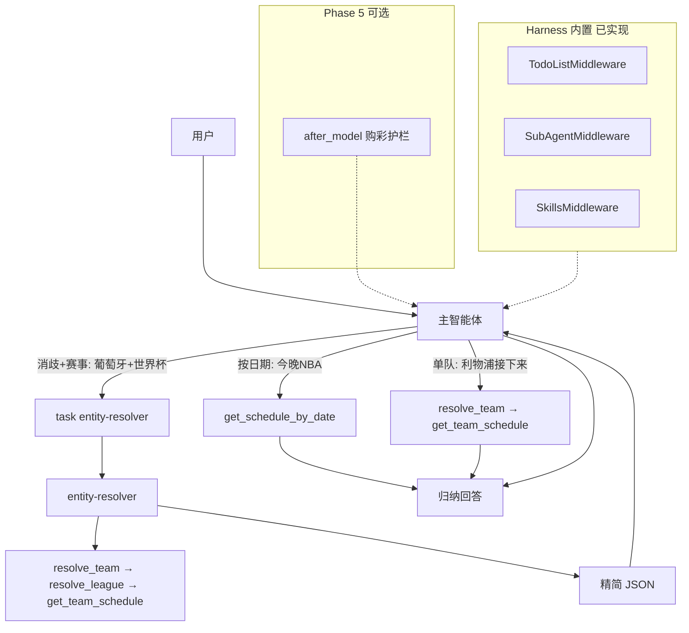

# Foretell Phase 5 — 架构细化与赛程质量修复

> **For agentic workers:** REQUIRED SUB-SKILL: Use superpowers:subagent-driven-development (recommended) or superpowers:executing-plans to implement this plan task-by-task. Steps use checkbox (`- [ ]`) syntax for tracking.

**Goal:** 在 Phase 0–4 已交付骨架之上，落实 Tool / Skill / Subagent / Middleware 四层分工，修复实体链赛程查询（如「葡萄牙下一场世界杯」），统一 MySQL `match_time`（Unix int）比较逻辑，并补齐 Skills 加载。

**Architecture:** 主智能体编排（轻量直达 or `task` 委派）；`entity-resolver` 子智能体承担**消歧 + 多步实体链**脏活并返回精简 JSON；Tool 层承载确定性 DB 语义；Harness 内置中间件（TodoList / SubAgent / Skills）已启用，第二层自定义 Middleware 仅用于购彩免责等横切逻辑（可选）。

**Tech Stack:** Python 3.11+, deepagents (≥0.6.11), langchain, langgraph, FastAPI, pytest, MySQL `data_center`

## Global Constraints

- 部署：自托管；生产 default Backend 禁止 FilesystemBackend 越权读盘
- 无代码沙箱、无运行时 `SHOW TABLES` / Text-to-SQL（`match_time` 类型已在探针中确认为 `int` Unix 时间戳，实现时直接按此编码）
- 购彩回复结尾必须含「⚠️ 彩票有风险，投注需谨慎」
- 不暴露工具名/字段名；不输出「正在查询」中间态
- 会话态靠 Checkpointer，不做 match_context Store 键
- 状态码在 Tool 层判定，LLM 不猜
- 不为每个业务场景新建子智能体；实体链复用 `entity-resolver`
- **委派原则：** 仅「实体消歧」或「多步定位」（对阵、竞彩编号、G7、球队+赛事过滤等）委派 `entity-resolver`；**简单单队赛程**（如「利物浦接下来踢谁」）主智能体 `resolve_team` → `get_team_schedule` 直达，不委派

---

## 现状与缺口（已用真实 DB 验证）

| 项 | 现状 | 缺口 |
|----|------|------|
| Phase 0–4 | 已合并，`81 passed` | — |
| 主智能体 Tool | 19 个业务 Tool | 合理，轻量直达需要 |
| 子智能体 Tool/Skill | 已按维度拆分 | `entity-resolver` 缺 `get_team_schedule` |
| `resolve_team` | `LIKE` + `LIMIT 1` | 实测「葡萄牙」命中 id=10206 俱乐部，国家队 id=13152 被跳过 |
| `get_team_schedule` | `ORDER BY DESC`，无赛事过滤 | 无法答「下一场世界杯」；「最近五场」与「下一场」未区分 |
| `match_time` | DB 为 **Unix int**；多处 `DATE()` / `CURDATE()` | 实测 `DATE(match_time)=CURDATE()` 今日 0 场；`UNIX_TIMESTAMP` 日界 542 场 |
| `foretell-light-query` | 三条路径说明 | 缺「直达 vs 委派 entity-resolver」路由 |
| Skills 加载 | `StateBackend` + 磁盘绝对路径 | SkillsMiddleware 需 Backend 虚拟路径；子 agent `skills=` 亦为绝对路径 |
| 购彩护栏 | SYSTEM_PROMPT + Skill 文案 | 无运行时 `after_model`（可选增强） |

**DB 探针结论（`data_center`）：**

- `football_match.match_time`：`int`，Unix 时间戳
- `football_team.national`：`0/1` 俱乐部 vs 国家队；另有 `national_players`（人数，**不可**作国家队标志）
- 葡萄牙国家队 `team_id` 对应 MySQL `id=13152`；世界杯 `competition_id=1`

---

## 目标架构（Phase 5 落地）



### 四层分工（最终态）

| 层 | Phase 5 动作 |
|----|-------------|
| **Tool** | `resolve_team` 消歧；`match_time` 统一 helper；`get_team_schedule` 赛事/方向；修全库 `DATE()` 误用 |
| **Skill** | 更新 `foretell-light-query`、`foretell-entity-resolution` 路由说明 |
| **Subagent** | `entity-resolver` 增加 `get_team_schedule`；更新 description / JSON 契约 |
| **Middleware** | 修 Skills Backend + 子 agent `skills=` 路径；可选购彩 `after_model` |

---

## Task 5.1 — Tool：`resolve_team` 消歧（国家队 / 俱乐部）

**Files:** [`foretell/tools/crazy_sports/mysql_client.py`](foretell/tools/crazy_sports/mysql_client.py), [`foretell/tools/crazy_sports/client.py`](foretell/tools/crazy_sports/client.py), [`foretell/tools/crazy_sports/mock_data.py`](foretell/tools/crazy_sports/mock_data.py), [`tests/unit/test_entity_tools.py`](tests/unit/test_entity_tools.py)

**问题：** `LIMIT 1` 在 LIKE 下返回「葡萄牙体育」俱乐部（`national=0`），非成年男足国家队。

- [ ] `mysql_client.resolve_team` 改为多候选查询，**排序规则（按优先级）**：
  1. **精确匹配**（`short_name_zh` / `name_zh` 与查询词相等）优于模糊 `LIKE`
  2. 同匹配级别下 `national=1` 优先（仅歧义时加权，非全局覆盖）
  3. 排除青年队 / 女足 / B 队等（名称含 `U16`/`U17`/`U19`/`U21`/`女足`/`B队` 等，除非用户原文含对应关键词）
  4. 返回 top-1；`meta` 含 `is_national`；多候选接近时 `meta.disambiguation_note` 简述备选
- [ ] SELECT 增加 `national` 字段（**不用** `national_players`）；`_row_team` 透出 `national`
- [ ] Mock：增加 `t_portugal_nt`（国家队）与 `t_portugal_sporting`（俱乐部）歧义样本
- [ ] 单元测试：
  - `resolve_team("葡萄牙")` → 国家队
  - `resolve_team("葡萄牙体育")` → 俱乐部（反例，防止过度国家队优先）

**验收：** `uv run pytest tests/unit/test_entity_tools.py -v`

---

## Task 5.2 — Tool：`match_time` 统一 + `get_team_schedule` 扩展

**Files:** [`foretell/tools/crazy_sports/mysql_client.py`](foretell/tools/crazy_sports/mysql_client.py), [`foretell/tools/schedule.py`](foretell/tools/schedule.py), [`foretell/tools/crazy_sports/client.py`](foretell/tools/crazy_sports/client.py), [`tests/unit/test_entity_tools.py`](tests/unit/test_entity_tools.py), 新建 [`tests/unit/test_schedule_tools.py`](tests/unit/test_schedule_tools.py)

**问题：** `match_time` 为 Unix int，`DATE(match_time)` 在 mysql 下几乎全失效；`get_team_schedule` 无赛事过滤与方向语义。

### 5.2a — `match_time` 统一 helper（阻塞项）

- [ ] 在 `mysql_client.py` 增加内部 helper（如 `_match_time_on_date(col, date)`、`_match_time_upcoming(col)`），统一用 `UNIX_TIMESTAMP` / 日界区间比较
- [ ] **一次性替换**以下误用（不限于 `get_team_schedule`）：
  - `resolve_match`：`DATE(m.match_time) = %s`
  - `resolve_lottery_match`：`DATE(match_time) = %s`
  - `get_schedule_by_date`：`WHERE DATE(m.match_time) = %s`（「今天有什么比赛」核心路径）
  - `get_lottery_schedule`：`DATE(match_time)` / `match_time >= CURDATE()`
  - `get_team_schedule`：时间过滤与排序
- [ ] 单元测试：mysql 标记 `-m mysql` 下今日赛程 count > 0（或 mock 下 helper 行为）

### 5.2b — `get_team_schedule` 参数与语义

- [ ] 增加可选参数：
  - `league_id: str | None` — 赛事过滤，格式 `fc_<competition_id>`（与 envelope 一致）
  - `direction: Literal["upcoming", "recent", "all"]` — **默认 `recent`**（兼容「最近五场」与现有测试）；「下一场」由 Skill 显式传 `upcoming`
- [ ] `upcoming`：`match_time > UNIX_TIMESTAMP(NOW())` + `status_id` 未结束（对齐 `_FINISHED_STATUS_IDS`）+ `ORDER BY match_time ASC`
- [ ] `recent`：已结束或过去场次 + `ORDER BY match_time DESC`
- [ ] Tool schema 与 docstring 同步；Mock client 对齐三参数
- [ ] 单元测试：三 `direction` + `league_id` 组合；`recent` 默认行为回归

**验收：** `uv run pytest tests/unit/test_schedule_tools.py tests/unit/test_entity_tools.py -v`

---

## Task 5.3 — Subagent：`entity-resolver` 扩展实体链赛程能力

**Files:** [`foretell/subagents/definitions.py`](foretell/subagents/definitions.py), [`tests/unit/test_subagents.py`](tests/unit/test_subagents.py)

- [ ] `ENTITY_RESOLVER_TOOLS` 增加 `get_team_schedule`（仅此一个赛程 Tool）
- [ ] 更新 `description`：补充「某队 + 某赛事 + 下一场/赛程」类问法
- [ ] 更新 `system_prompt`：实体链步骤与 JSON 契约（扩展 `_SUBAGENT_JSON_OUTPUT`，不混用深度分析维度）：
  - `dimension=entity`
  - `match_id`（赛程场景可为主键；无单场时可为空并放在 `stats.upcoming_match`）
  - `stats` 含：`team_id`、`league_id`（若有）、`match_time_beijing`、主客队、`league_name`
  - `status_map` 覆盖 `resolve_team` / `resolve_league` / `get_team_schedule`
- [ ] `test_subagents_have_tools_and_skills` 断言工具数变更

**验收：** `uv run pytest tests/unit/test_subagents.py -v`

---

## Task 5.4 — Skill：轻量查询与实体定位路由

**Files:**
- [`foretell/skills/foretell-light-query/SKILL.md`](foretell/skills/foretell-light-query/SKILL.md)
- [`foretell/skills/foretell-entity-resolution/SKILL.md`](foretell/skills/foretell-entity-resolution/SKILL.md)
- [`foretell/prompts.py`](foretell/prompts.py)

- [ ] `foretell-light-query` 新增「路由决策表」：

  | 问法 | 路径 |
  |------|------|
  | 今晚 NBA / 今天足球 | 主智能体 → `get_schedule_by_date` |
  | 利物浦接下来踢谁 / 湖人最近五场 | 主智能体 → `resolve_team` → `get_team_schedule`（后者按需 `direction=upcoming` 或 `recent`） |
  | 葡萄牙下一场世界杯 / 对阵 / 竞彩编号 / G7 | 主智能体 → `task(entity-resolver)` |
  | 已有 `match_id` | 直接查，不委派 |

- [ ] `foretell-entity-resolution` 补充实体链赛程步骤：
  1. `resolve_team`（注意国家队消歧）
  2. 若用户提及赛事 → `resolve_league`
  3. `get_team_schedule(team_id, league_id=..., direction=upcoming)`（「下一场」场景）
- [ ] `SYSTEM_PROMPT` 增加一条编排原则（与 Global Constraints 委派原则一致）

**验收：** `uv run pytest tests/unit/test_skills.py -v`

---

## Task 5.5 — Skills 加载：Backend 与 `skills=` 路径配对

**Files:** [`foretell/backends.py`](foretell/backends.py), [`foretell/agent.py`](foretell/agent.py), [`foretell/subagents/definitions.py`](foretell/subagents/definitions.py), [`tests/unit/test_backends.py`](tests/unit/test_backends.py), 新建 [`tests/integration/test_skills_loading.py`](tests/integration/test_skills_loading.py)

**问题：** `StateBackend` 不读磁盘；`skills=[str(FORETELL_SKILLS_DIR)]` 与 SkillsMiddleware 虚拟路径约定不符；子 agent `skills=` 亦为绝对路径。

**方案（dev / prod 分轨）：**

- [ ] **dev：** `CompositeBackend`：
  - `default`：`StateBackend()`（不用 deprecated `StateBackend(runtime)`）
  - `routes`：`/skills/` → `FilesystemBackend(root_dir=PROJECT_ROOT/foretell/skills, virtual_mode=True)`
  - **注意：** `root_dir` 必须是 `foretell/skills` 目录本身，**不是** `PROJECT_ROOT`
- [ ] 主 agent `skills=["/skills/"]`；子 agent 改为虚拟路径，例如：
  - `/skills/foretell-entity-resolution/`
  - `/skills/foretell-status-dictionary/`
- [ ] **prod（写死一种）：** API/进程启动时将 `foretell/skills/` **seed** 到 StateBackend 的 `/skills/` 前缀（与 spec §3.2「禁止 default FilesystemBackend」一致）；不在请求路径使用 FilesystemBackend
- [ ] 集成测试：`create_foretell_agent` 后首轮 state `skills_metadata` 非空且无 `skills_load_errors`（≥11 个 foretell skill）

**验收：** `uv run pytest tests/unit/test_backends.py tests/integration/test_skills_loading.py -v`

---

## Task 5.6 — Middleware（可选）：购彩免责 `after_model`

**Files:** 新建 [`foretell/middleware/betting_guardrail.py`](foretell/middleware/betting_guardrail.py), [`foretell/agent.py`](foretell/agent.py), 扩展 [`tests/unit/test_betting_guardrail.py`](tests/unit/test_betting_guardrail.py)

**优先级：** 低于 5.7；Prompt + Skill 已有多层护栏。实施前可做 10 行 spike 确认 `after_model` 能修改最终 AIMessage。

- [ ] `@after_model`：购彩语境且缺免责句时追加
- [ ] `create_deep_agent(..., middleware=[BettingGuardrailMiddleware()])`
- [ ] 单元测试：含购彩词无免责 → 追加；非购彩 → 不改动

**验收：** `uv run pytest tests/unit/test_betting_guardrail.py -v`

---

## Task 5.7 — 集成验收：实体链赛程场景

**Files:** 新建 [`tests/integration/test_schedule_entity_chain.py`](tests/integration/test_schedule_entity_chain.py)；扩展 [`foretell/tools/crazy_sports/mock_data.py`](foretell/tools/crazy_sports/mock_data.py)

- [ ] Mock 样本：葡萄牙国家队 + 世界杯联赛 + 未来场次（`TEAMS` / `LEAGUES` / `MATCHES` / `TEAM_SCHEDULE`）
- [ ] Mock 工具链：`resolve_team → resolve_league → get_team_schedule(upcoming)` envelope 断言
- [ ] MySQL（`pytest -m mysql`）：`team_id=13152` + `competition_id=1` 有未来场次时返回 OK
- [ ] 路由回归：
  - 「葡萄牙 + 世界杯」路径：mock `task` 调用计数 ≥ 1（或 LangGraph 事件断言）
  - 「利物浦接下来踢谁」：主 agent 工具链直达，`task` 未被调用
  - 「今晚 NBA」：`get_schedule_by_date`，`task` 未被调用

**验收：** `uv run pytest tests/integration/test_schedule_entity_chain.py -v`

---

## Task 5.8 — 文档同步

**Files:**
- [`docs/superpowers/specs/2026-06-21-foretell-self-hosted-design.md`](docs/superpowers/specs/2026-06-21-foretell-self-hosted-design.md) §6–8
- [`docs/DEVELOPMENT.md`](docs/DEVELOPMENT.md)

- [ ] Spec：场景 A 双路径（直达 vs 委派）、`match_time` Unix 约定、Middleware 两层含义、entity-resolver 赛程职责、prod Skills seed
- [ ] DEVELOPMENT：dev CompositeBackend 配置、`skills=` 虚拟路径约定

**须在 Task 5.4 路由表定稿后编写。**

---

## 实施顺序与依赖

```
5.1 resolve_team ──┐
5.2 match_time + get_team_schedule ──┼──► 5.3 entity-resolver ──► 5.4 Skills（路由定稿）
5.5 Skills Backend ──┘（可与 5.3 并行，5.7 前必须完成）
        │
        └──► 5.7 集成验收 ──► 5.6 购彩 Middleware（可选）──► 5.8 文档
```

**推荐执行顺序：** 5.1 → 5.2 → 5.5 → 5.3 → 5.4 → 5.7 → 5.6（可选）→ 5.8

---

## Phase 5 验收清单

1. `uv run pytest` 全绿（含新增测试）
2. Mock 下「葡萄牙 + 世界杯 + 下一场」工具链返回正确 envelope
3. mysql 下 `get_schedule_by_date(今日)` 返回场次 > 0（`-m mysql`）
4. `entity-resolver` 含 `get_team_schedule`；Skill 写明委派 vs 直达边界
5. dev 环境 `skills_metadata` 加载成功（≥11 foretell skills）
6. reviewer 无 blocking 问题
7. 合并到 `develop`，打 tag `foretell-phase-5`

---

## 明确不做（YAGNI）

- 不新建 `schedule-resolver` 子智能体
- 不为 8 个场景各建独立子智能体
- Phase 5 不引入 `LLMToolSelectorMiddleware`（19 Tool 尚可接受，留 Phase 6）
- 不让 Agent 运行时探索表结构
- 不强制主智能体瘦身为「只有 task」（保留轻量直达）
- Phase 5 不实现 `web_search_fallback`（实体定位 Web 兜底留后续）

---

## 参考

- DataWhale 中间件章节：https://datawhalechina.github.io/deepagents-in-action/chapters/ch04-task-planning/
- LangChain Deep Agents：[Subagents](https://docs.langchain.com/oss/python/deepagents/subagents)、[Skills](https://docs.langchain.com/oss/python/deepagents/skills)、[Backends](https://docs.langchain.com/oss/python/deepagents/backends)
- 原实现计划：[`2026-06-21-foretell-implementation.md`](2026-06-21-foretell-implementation.md)
- DB 探针脚本（开发参考）：[`scripts/probe_portugal_wc.py`](../../../scripts/probe_portugal_wc.py)
